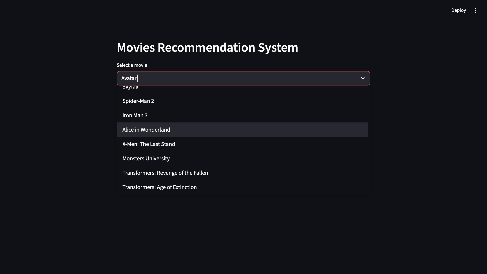
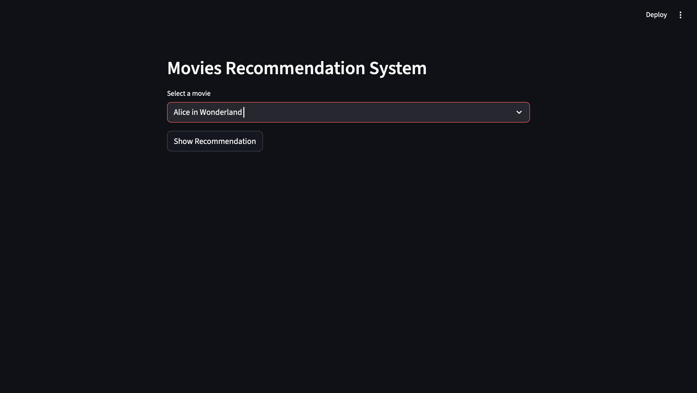
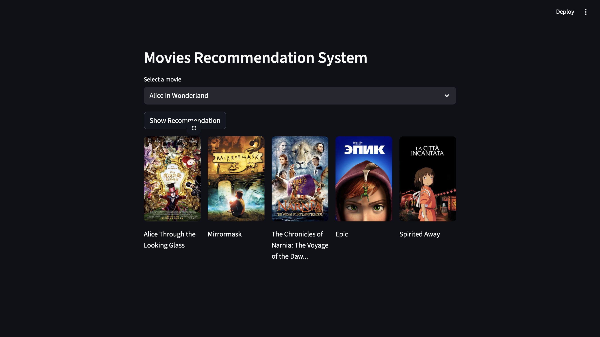

# Project Objective

Create a content-based recommendation system for movies. Users can choose a movie and receive recommendations for other similar movies.

# Project Overview

1. Uses Pandas for initial data processing to extract words that describe the movies.
2. Uses NLTK.stem to remove morphological affixes from the words.
3. Uses Scikit-Learn for word vectorization and cosine similarity calculation.
4. Uses Streamlit to build a simple web interface, allowing users to choose a movie and receive recommendations based on how similar other movies' descriptions are to the chosen movie.
5. Uses the TMDB API to load movie posters.

# User Guide

1. Choose a movie

2. Click "Show Recommendation"

3. Get the recommendation!

# Sources / References

- TMDB Dataset: [TMDB 5000 Movie Dataset](https://www.kaggle.com/datasets/tmdb/tmdb-movie-metadata)
- Pandas Documentation: [Pandas Documentation](https://pandas.pydata.org/docs/user_guide/index.html#user-guide)
- NLTK.stem Documentation: [NLTK.stem Documentation](https://www.nltk.org/api/nltk.stem.html)
- Scikit-Learn Documentaiton: [Scikit-Learn Documentaiton](https://scikit-learn.org/stable/data_transforms.html)
- Streamlit Documentation: [Streamlit Documentation](https://docs.streamlit.io/get-started)
- TMDB API Reference: [TMDB API Documentation](https://developer.themoviedb.org/reference/getting-started)